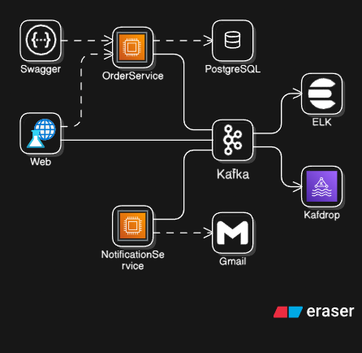
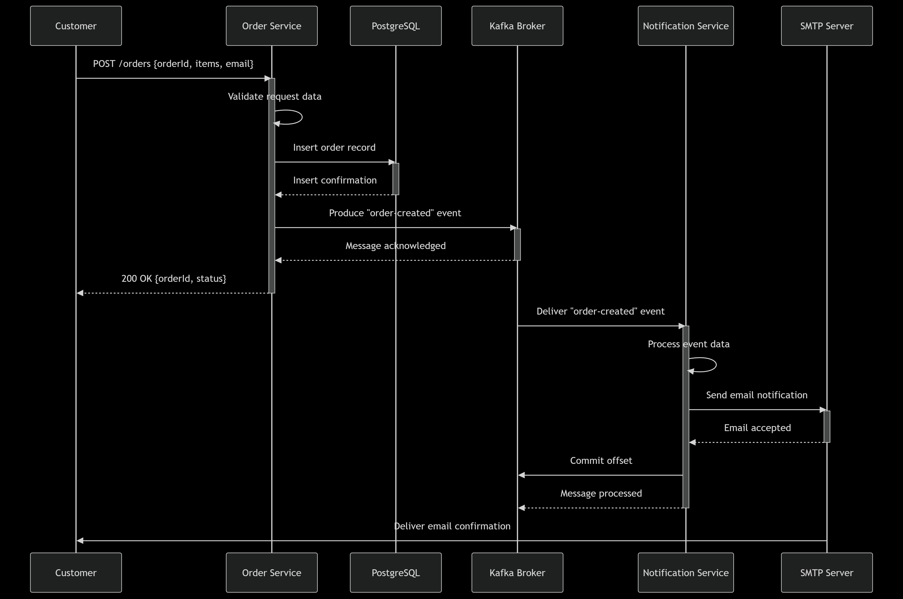

# System Design Document

## 1. Overview and Goals
- **Problem Being Solved:**
    - Building a scalable order management system with real-time email notifications to keep customers informed about their order status
- **Primary Goals and Success Criteria:**
    - Process orders reliably with REST API
    - Send email notifications within seconds of order creation
    - Ensure system reliability with fault-tolerant messaging
    - Support horizontal scaling for high throughput
- **Non‑goals (Intentionally Not Addressed):**
    - Payment processing integration
    - Inventory management system
    - User authentication/authorization
    - Mobile push notifications
    - Order status tracking beyond creation

## 2. Architecture Overview
- **High-level Architecture Diagram:**
    - 
- **Sequence Diagram:**
    - 
- **Data Flow and Control Flow:**
    1. **Order Creation Phase:**
        - Customer sends POST request to Order Service with order details
        - Order Service validates the request data (`orderId`, items, email format)
        - Order Service persists the order to PostgreSQL database for durability
        - Order Service produces `order-created` event to Kafka topic
        - Customer receives immediate response with order confirmation
    2. **Event Processing Phase:**
        - Kafka Broker asynchronously delivers the event to Notification Service
        - Notification Service consumes the event and extracts order information
        - Notification Service constructs email content with order details
    3. **Notification Delivery Phase:**
        - Notification Service connects to SMTP server (Gmail) for email delivery
        - SMTP Server accepts email for delivery to customer's inbox
        - Notification Service commits Kafka offset only after successful email acceptance
        - SMTP Server asynchronously delivers the email to customer's email address

## 3. Components
- **Order Service:**
    - **Responsibilities:**
        - REST API for order creation
        - Data validation and persistence
        - Event publishing to Kafka
    - **Key Endpoints:**
        - POST /orders - Create new order
        - GET /health - API healthCheck
    - **Data Validation:**
        - Required fields: `orderId`, `itemId[]`
        - Unique order
        - Type validation and sanitization

- **Notification Service:**
    - **Responsibilities:**
        - Consume `order-created` events from Kafka
        - Send email notifications via SMTP
        - Handle email delivery failures
    - **Idempotency:**
        - Natural idempotency through `orderId`-based processing
        - No duplicate emails for same `orderId`

- **Message Broker (Kafka):**
    - **Choice Rationale:**
        - High throughput and durability
        - Exactly-once semantics support

## 4. Interfaces and Contracts
- **REST API:**
    - **Endpoints:**
        - `POST /orders` - Create new order
        - `GET /health` - API healthCheck
    - **Request Example:**
        ```json
        {
          "orderId": "string",
          "itemId": ["string1", "string2"],
        }
        ```
    - **Response Example:**
        ```json
        {
          "success": true,
          "data": {
            "internalId": "uuid",
            "orderId": "string",
            "itemId": ["string1", "string2"],
            "createdAt": "ISO8601"
          },
          "message": "Order created and event sent to queue"
        }
        ```

        We use UUID on internalId instead of orderId for better comprehensive test case
    - **Error Responses:**
        - 202 - Accepted
        - 400 - Validation failed
        - 409 - Duplicate order
        - 500 - Internal server error

- **Event Schema:**
    - **Topic:** `order-created`
    - **Message Example:**
        ```json
        {
          "id": "uuid",                         // Internal tracking ID
          "orderId": "string",                  // Business order ID
          "itemId": ["string1", "string2"],     // Array of item IDs
          "createdAt": "ISO8601"                // Event timestamp
        }
        ```
    - **Delivery Semantics:**
        - At-least-once delivery
        - Versioned schema (future-proofing)

## 5. Sequence and Data Flow
- Sequence diagram(s) for order creation → notification
- Example logs for success and error paths

## 6. Reliability and Fault Tolerance
- **Idempotency Strategy:**
    - Natural idempotency via unique `orderId`
    - No database deduplication needed for notifications
- **Retry Strategy:**
    - Exponential backoff for SMTP failures (1s, 2s, 4s, ...)
    - Maximum 5 retries per email
- **Dead-letter Handling:**
    - Manual DLQ implementation for persistent failures
    - Admin alerts for stuck messages
- **Broker Outage Handling:**
    - Producer: Buffered retries with circuit breaker
    - Consumer: Auto-reconnect with backoff

## 7. Scalability and Performance
- **Throughput Assumptions:**
    - 100 orders/minute baseline
    - 1000 orders/minute peak capacity
- **Bottlenecks:**
    - SMTP API rate limits (Gmail: 100 emails/day free tier)
    - Database write capacity
    - Kafka partition throughput
- **Scaling Strategy:**
    - Order Service: Stateless, scale horizontally
    - Notification Service: Consumer group scaling
    - Kafka: Add partitions for increased throughput
- **Partitioning:**
    - Current: Single partition for simplicity
    - Future: Partition by `orderId` for better distribution

## 8. Security and Compliance
- **Secrets Management:**
    - Environment variables in Docker containers
    - `.env` files excluded from version control
    - Secret rotation required for production
    - SMTP credentials stored as environment variables
- **AuthN/AuthZ Assumptions:**
    - No authentication in current implementation
    - API gateway recommended for production
- **Compliance:**
    - Email content includes required business information
    - No PII beyond email address in notifications

## 9. Observability
- **Logging:**
    - Structured JSON logging
    - Correlation IDs for request tracing
    - Log levels: DEBUG, INFO, WARN, ERROR
- **Metrics to Collect:**
    - Orders processed per minute
    - Email delivery latency
    - Error rates by service
    - Kafka consumer lag
- **Alerting:**
    - High email failure rate (>5%)
    - Consumer lag > 1000 messages
    - Service health check failures
    - SMTP authentication errors

## 10. Deployment and Operations
- **Local Development Setup:**
    - `docker-compose.yml` includes:
        - PostgreSQL container
        - Kafka + Zookeeper containers
        - Kafdrop for Kafka UI
        - Order Service container
        - Notification Service container
- **Production Deployment:**
    - Kubernetes deployment with health checks
    - ConfigMaps for environment configuration
    - Horizontal Pod Autoscaler based on CPU/memory
    - Managed Kafka service (AWS MSK/Confluent Cloud)
- **Configuration Management:**
    - Environment-specific config files
    - Build-time configuration injection
    - Runtime configuration validation


## 11. Trade‑offs and Alternatives
- **Chosen Approach:**
    - Kafka for messaging
- **Pros:**
    - Durability
    - Scalability
    - Strong ecosystem
- **Cons:**
    - Operational complexity
    - Resource intensive
- **Alternatives Considered:**
    - RabbitMQ: Simpler setup but less scalable
    - Redis Pub/Sub: Faster but less durable
    - SQS/SNS: Managed but vendor lock-in
- **Trade-offs:**
    - Simplicity vs Scalability: Chose scalability with Kafka
    - Delivery Semantics: At-least-once over exactly-once for simplicity
    - Email Reliability: Best-effort delivery with retries

## 12. Risks and Mitigations
- **Top Risks:**
    - SMTP Rate Limiting
        - Mitigation: Queue-based throttling
    - Kafka Data Loss
        - Mitigation: Replication and acks=all
    - Database Bottlenecks
        - Mitigation: Read replicas, caching
    - Email Deliverability
        - Mitigation: SPF/DKIM configuration
- **Mitigation Strategies:**
    - Circuit breakers for external dependencies
    - Graceful degradation during outages
    - Comprehensive monitoring and alerting
    - Regular load testing and capacity planning

## 13. Future Work
- **Short-term (Next 3 months):**
    - Order status update notifications
    - SMS notification integration
    - Admin dashboard for message tracking
    - Enhanced error handling and retry logic
- **Medium-term (3-6 months):**
    - Payment processing integration
    - Inventory management system
    - User authentication and authorization
    - Advanced analytics and reporting
- **Long-term (6+ months):**
    - Multi-channel notifications (push, webhook)
    - Internationalization support
    - Machine learning for delivery optimization
    - Event sourcing architecture migration
- **Expected Impact:**
    - 30% reduction in customer support queries
    - 95%+ customer satisfaction with notifications
    - Support for 10x current order volume
    - Reduced operational overhead through automation
